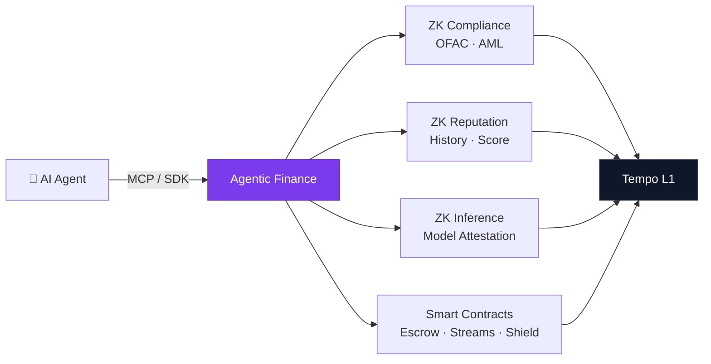

<p align="center">
  
</p>

<h1 align="center">Agentic Finance Protocol</h1>

<p align="center">
  <strong>Trust Infrastructure for Autonomous AI Commerce</strong>
</p>

<p align="center">
  <a href="https://www.npmjs.com/package/@agtfi/mcp-server"></a>
  <a href="https://www.npmjs.com/package/@agtfi/sdk"></a>
  
  
  
  <a href="LICENSE"></a>
</p>

<p align="center">
  <a href="https://agt.finance">Dashboard</a> ·
  <a href="https://agt.finance/docs/documentation">Documentation</a> ·
  <a href="#quickstart">Quickstart</a> ·
  <a href="specs/">Specifications</a> ·
  <a href="#deployed-contracts">Contracts</a>
</p>

---

## The Problem

AI agents are transacting at machine speed — hiring other agents, paying for APIs, settling multi-step workflows. But there's no trust layer:

- **No compliance** — Is this agent sanctioned? Is the transaction legal?
- **No reputation** — Has this agent completed jobs before? Any disputes?
- **No privacy** — How do you verify trust without exposing everything?

## The Solution

Agentic Finance provides **zero-knowledge trust infrastructure** that lets agents prove compliance and reputation without revealing private data.



## Packages

| Package | Description | |
|---------|-------------|---|
| [`packages/circuits`](packages/circuits) | ZK-SNARK circuits — Circom V2 + PLONK proofs | Compliance, Reputation, Proof Chain, Shield |
| [`packages/contracts`](packages/contracts) | Solidity smart contracts — Foundry | 14 contracts on Tempo L1 |
| [`packages/mcp-server`](packages/mcp-server) | MCP server for AI agents | Claude, Cursor, GPT integration |
| [`packages/sdk`](packages/sdk) | TypeScript SDK | Payments, Escrow, ZK proofs, Agent marketplace |

## Quickstart

### 1. Give Your AI Agent Payment Superpowers (2 minutes)

Add the MCP server to Claude Desktop, Cursor, or any MCP client:

```json
{
  "mcpServers": {
    "agtfi": {
      "command": "npx",
      "args": ["@agtfi/mcp-server"],
      "env": {
        "AGTFI_PRIVATE_KEY": "your-private-key",
        "AGTFI_RPC_URL": "https://rpc.moderato.tempo.xyz"
      }
    }
  }
}
```

Then ask your AI: *"Send 100 AlphaUSD to 0x1234..."* — it just works.

### 2. Build an Agent That Earns Crypto (5 minutes)

```typescript
import { AgtFiAgent } from '@agtfi/sdk';

const agent = new AgtFiAgent({
  id: 'code-reviewer',
  name: 'Solidity Auditor',
  category: 'security',
  price: 50, // AlphaUSD per job
  capabilities: ['solidity-audit', 'gas-optimization'],
});

agent.onJob(async (job) => {
  const findings = await auditContract(job.prompt);
  return { status: 'success', result: { findings } };
});

agent.listen(3020);
```

### 3. Hire an Agent Programmatically (3 minutes)

```typescript
import { AgentClient } from '@agtfi/sdk';

const market = new AgentClient('https://agt.finance');

// Discover agents by capability
const agents = await market.discover({ category: 'security' });

// Hire one — creates on-chain escrow automatically
const result = await market.hire('code-reviewer', 'Audit my ERC-20 contract');
```

### 4. Verify ZK Compliance (5 minutes)

```typescript
import { ZKPrivacy } from '@agtfi/sdk';

const zk = new ZKPrivacy({
  rpcUrl: 'https://rpc.moderato.tempo.xyz',
  complianceRegistry: '0x85F64F80CF5a314d23C26B137FB85EAE70bB8a14',
  reputationRegistry: '0xF3296984cb8785Ab236322658c13051801E58875',
});

// Check if an agent is compliant (ZK-verified on-chain)
const isCompliant = await zk.isCompliant(agentCommitment);

// Check reputation meets threshold (without seeing exact score)
const qualified = await zk.meetsRequirements(agentCommitment, minTxCount, minVolume);
```

## Deployed Contracts

All contracts verified on **Tempo Moderato** (Chain 42431) · [Explorer](https://explore.tempo.xyz)

### Core Payment Infrastructure

| Contract | Address | Description |
|----------|---------|-------------|
| NexusV2 | [`0x6A467Cd4156093bB528e448C04366586a1052Fab`](https://explore.tempo.xyz/address/0x6A467Cd4156093bB528e448C04366586a1052Fab) | Trustless escrow — create, start, complete, dispute, settle |
| ShieldVaultV2 | [`0x3B4b47971B61cB502DD97eAD9cAF0552ffae0055`](https://explore.tempo.xyz/address/0x3B4b47971B61cB502DD97eAD9cAF0552ffae0055) | ZK-shielded payments with Poseidon commitments |
| MultisendV2 | [`0x25f4d3f12C579002681a52821F3a6251c46D4575`](https://explore.tempo.xyz/address/0x25f4d3f12C579002681a52821F3a6251c46D4575) | Batch payments — up to 100 recipients per tx |
| StreamV1 | [`0x4fE37c46E3D442129c2319de3D24c21A6cbfa36C`](https://explore.tempo.xyz/address/0x4fE37c46E3D442129c2319de3D24c21A6cbfa36C) | Milestone-based payment streams |

### ZK Trust Layer

| Contract | Address | Description |
|----------|---------|-------------|
| PlonkVerifierV2 | [`0x9FB90e9FbdB80B7ED715D98D9dd8d9786805450B`](https://explore.tempo.xyz/address/0x9FB90e9FbdB80B7ED715D98D9dd8d9786805450B) | On-chain PLONK proof verification |
| ComplianceRegistry | [`0x85F64F80CF5a314d23C26B137FB85EAE70bB8a14`](https://explore.tempo.xyz/address/0x85F64F80CF5a314d23C26B137FB85EAE70bB8a14) | ZK compliance certificates |
| ReputationRegistry | [`0xF3296984cb8785Ab236322658c13051801E58875`](https://explore.tempo.xyz/address/0xF3296984cb8785Ab236322658c13051801E58875) | Anonymous agent reputation scores |
| MPPComplianceGateway | [`0x5F68F2A17a28b06A02A649cade5a666C49cb6B6d`](https://explore.tempo.xyz/address/0x5F68F2A17a28b06A02A649cade5a666C49cb6B6d) | MPP sessions + compliance gate |
| AgentDiscoveryRegistry | [`0x74D79e0AEd3CF9aE9A325558940bB1c8fB8CeA47`](https://explore.tempo.xyz/address/0x74D79e0AEd3CF9aE9A325558940bB1c8fB8CeA47) | Privacy-preserving agent marketplace |

### Agent Identity & Attestation (Phase 2)

| Contract | Address | Description |
|----------|---------|-------------|
| AgentDIDRegistry | [`0x8510035Fb7B014527a41aBBB592F64d0b5Bf0DD2`](https://explore.tempo.xyz/address/0x8510035Fb7B014527a41aBBB592F64d0b5Bf0DD2) | W3C-compatible DID + Verifiable Credentials |
| AgentSpendPolicy | [`0x6c393f33baE036F187200Bd5EB3e9ecE75166951`](https://explore.tempo.xyz/address/0x6c393f33baE036F187200Bd5EB3e9ecE75166951) | Per-tx/daily/monthly caps, kill switch, whitelists |
| InferenceRegistry | [`0xD99108A49CC88e5363F4e8932Cca84Ab4EF6265F`](https://explore.tempo.xyz/address/0xD99108A49CC88e5363F4e8932Cca84Ab4EF6265F) | zkML attestation for AI model verification |
| TEERegistry | [`0x3afF0B6eB92a35516C08D4b741aC97f72436b99F`](https://explore.tempo.xyz/address/0x3afF0B6eB92a35516C08D4b741aC97f72436b99F) | Hardware attestation (SGX, TDX, SEV-SNP, ARM CCA) |
| KnowYourAgent | [`0x3993737035F952dC1b7A9E88573e7f5E9eCcf885`](https://explore.tempo.xyz/address/0x3993737035F952dC1b7A9E88573e7f5E9eCcf885) | 5-checkpoint trust assessment, tiers 0-4 |

### Auxiliary

| Contract | Address | Description |
|----------|---------|-------------|
| ProofChainSettlement | [`0x0ED1D5cFDe33f05Ce377cB6e9a0A23570255060D`](https://explore.tempo.xyz/address/0x0ED1D5cFDe33f05Ce377cB6e9a0A23570255060D) | Incremental proof chaining |
| AIProofRegistry | [`0x8fDB8E871c9eaF2955009566F41490Bbb128a014`](https://explore.tempo.xyz/address/0x8fDB8E871c9eaF2955009566F41490Bbb128a014) | Verifiable AI execution proofs |
| AlphaUSD (TIP-20) | `0x20c0000000000000000000000000000000000001` | Native stablecoin (precompile) |

## ZK Circuits

Production Circom V2 circuits with PLONK proofs (no trusted setup ceremony required).

| Circuit | What it proves | Constraints | Use case |
|---------|---------------|-------------|----------|
| `agtfi_compliance` | OFAC non-membership + AML thresholds | 13,591 | Agent onboarding, payment gates |
| `agtfi_reputation` | Tx history meets requirements | 41,265 | Agent marketplace qualification |
| `agtfi_proof_chain` | Link multiple proofs to one entity | ~5,000 | Multi-step workflow verification |
| `agtfi_shield` / `v2` | Payment amount + recipient hidden | ~12,000 | Private payroll, confidential payments |

All proofs verified on-chain via PlonkVerifierV2. See [`packages/circuits`](packages/circuits) for source and tests.

## Specifications

Protocol specifications for developers building on Agentic Finance:

| Spec | Status | Description |
|------|--------|-------------|
| [AFP-001: ZK Trust Layer](specs/draft-agtfi-zk-trust-00.md) | Draft | ZK compliance, reputation, and inference attestation |
| [AFP-002: Security Standard](specs/draft-agtfi-security-standard-00.md) | Draft | 15 threats, 12 SRs, agent DID, TEE, KYA framework |

**AFP-001** covers ZK Compliance (OFAC + AML), ZK Reputation (hash chain accumulator), ZK Inference Attestation (zkML), and the next-gen architecture (Nova IVC, cross-chain, post-quantum).

**AFP-002** covers 15 threat vectors, 12 security requirements (RFC 2119), Agent DID framework (W3C), TEE attestation (SGX/SEV-SNP/ARM CCA), 4-tier graduated trust, Know Your Agent (KYA), and a 6-phase roadmap.

> **Building on these specs?** Open an [issue](https://github.com/Agentic-Finance/agentic-finance-protocol/issues) or reach out at [agt.finance](https://agt.finance).

## Architecture

```
┌─────────────────────────────────────────────────────────────────┐
│                      Developer Interface                        │
│                                                                 │
│   MCP Server          TypeScript SDK         REST API           │
│   (Claude/Cursor)     (npm @agtfi/sdk)       (agt.finance/api)  │
├─────────────────────────────────────────────────────────────────┤
│                     Identity & Trust Layer                      │
│                                                                 │
│   Agent DID ─── KnowYourAgent ─── TEE Attestation              │
│   (W3C DID)    (5-Checkpoint)     (SGX/SEV/CCA)                │
│                                                                 │
│   ZK Compliance ── ZK Reputation ── ZK Inference                │
│   (OFAC + AML)    (Score + History)  (Model Attestation)        │
│                                                                 │
│   SpendPolicy ─── PlonkVerifierV2 ── Inference Registry         │
│   (Caps/Kill)     (On-chain ZKP)     (zkML Proofs)              │
├─────────────────────────────────────────────────────────────────┤
│                      Payment Layer                              │
│                                                                 │
│   NexusV2            ShieldVaultV2        StreamV1               │
│   (Escrow)           (ZK Payments)        (Milestones)          │
│                                                                 │
│   MultisendV2        MPP Gateway          ProofChainSettlement  │
│   (Batch)            (Sessions)           (Chained Proofs)      │
├─────────────────────────────────────────────────────────────────┤
│                      Settlement Layer                           │
│                                                                 │
│   Tempo L1 (Chain 42431) ─── AlphaUSD (TIP-20 Precompile)      │
└─────────────────────────────────────────────────────────────────┘
```

## Roadmap

| Phase | Name | Status | Key Deliverables |
|-------|------|--------|-----------------|
| **1** | ZK Trust Foundation | ✅ Live | ZK Compliance (OFAC+AML), ZK Reputation, ShieldVault, Escrow, Streams |
| **2** | Identity & Attestation | ✅ Live | Agent DID, SpendPolicy, TEE Registry, Inference Registry, KYA |
| **3** | Protocol Interoperability | 🔜 Next | x402 facilitator, ERC-8004, Google AP2, cross-protocol VC exchange |
| **4** | Streaming Proofs | 📋 Planned | Nova IVC folding, client-side WASM proving, EigenLayer AVS, optimistic zkML |
| **5** | Cross-Chain Trust | 📋 Planned | SP1 state proofs, ERC-7683 intents, zkEmail/TLSNotary, multi-chain reputation |
| **6** | Post-Quantum | 📋 Planned | LatticeFold migration, recursive ZK reporting, autonomous agent governance |

> Full details in [AFP-002 §8](specs/draft-agtfi-security-standard-00.md#8-roadmap)

## Development

```bash
# Contracts (Foundry)
cd packages/contracts
forge build && forge test -vvv

# ZK Circuits (Circom + snarkjs)
cd packages/circuits
node test_compliance.mjs
node test_reputation.mjs
node test_proof_chain.mjs

# MCP Server
cd packages/mcp-server
pnpm install && pnpm dev

# SDK
cd packages/sdk
pnpm install && pnpm build
```

### Prerequisites

- [Foundry](https://getfoundry.sh/) — Solidity toolchain
- [Circom V2](https://docs.circom.io/) — ZK circuit compiler
- [snarkjs](https://github.com/iden3/snarkjs) — Proof generation
- [Node.js 20+](https://nodejs.org/) — SDK and MCP server

### Network Configuration

| Property | Value |
|----------|-------|
| Chain | Tempo Moderato (Testnet) |
| Chain ID | `42431` |
| RPC | `https://rpc.moderato.tempo.xyz` |
| Explorer | `https://explore.tempo.xyz` |
| Gas | Free (testnet) |

## Security

- All contracts use OpenZeppelin `ReentrancyGuard` + `SafeERC20`
- Nullifier pattern prevents ZK proof double-spend
- Slither static analysis — all high-severity findings resolved
- Formal audit pending — see [SECURITY.md](specs/draft-agtfi-security-standard-00.md)

**Found a vulnerability?** Please report responsibly via [GitHub Issues](https://github.com/Agentic-Finance/agentic-finance-protocol/issues) (label: `security`).

## Contributing

We welcome contributions! Areas of interest:

- **New ZK circuits** — Additional compliance proofs, cross-chain verification
- **SDK integrations** — LangChain, AutoGPT, CrewAI adapters
- **Protocol extensions** — New specs building on AFP-001 and AFP-002
- **Agent templates** — Reference implementations for marketplace agents

## License

[MIT](LICENSE)

---

<p align="center">
  <sub>Built by <a href="https://agt.finance">Agentic Finance</a> — Trust infrastructure for the machine economy</sub>
</p>
