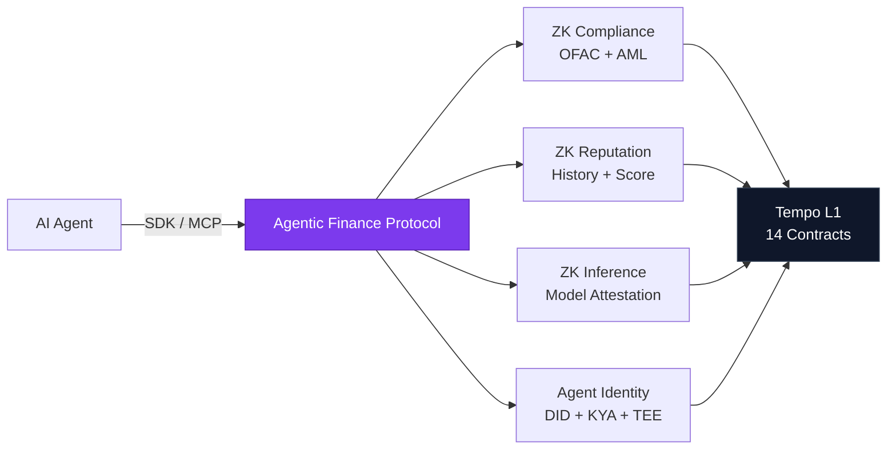

<p align="center">
  
</p>

<h1 align="center">Agentic Finance Protocol</h1>

<p align="center">
  <strong>Zero-Knowledge Trust Infrastructure for Autonomous AI Commerce</strong>
</p>

<p align="center">
  <a href="https://www.npmjs.com/package/@agtfi/mcp-server"></a>
  <a href="https://www.npmjs.com/package/@agtfi/sdk"></a>
  
  
  
  
  
  <a href="LICENSE"></a>
</p>

<p align="center">
  <a href="https://agt.finance">Website</a> &middot;
  <a href="specs/">Specifications</a> &middot;
  <a href="#quickstart">Quickstart</a> &middot;
  <a href="#deployed-contracts">Contracts</a> &middot;
  <a href="CONTRIBUTING.md">Contributing</a>
</p>

---

## Why Agentic Finance?

AI agents are transacting at machine speed &mdash; hiring other agents, paying for APIs, settling multi-step workflows. But the ecosystem lacks a trust layer:

| Problem | Without Us | With Agentic Finance |
|---------|-----------|---------------------|
| **Compliance** | Accept blindly or block all agents | ZK proof of OFAC non-membership + AML thresholds |
| **Reputation** | No way to verify agent track record | ZK proof of tx history without revealing details |
| **Inference** | Agent claims "I ran GPT-4" &mdash; unverifiable | zkML attestation proves model execution |
| **Identity** | Wallet address = identity (no privacy) | Poseidon commitment = pseudonymous on-chain ID |
| **Safety** | No spend limits, no kill switch | Programmable policies with emergency freeze |

**Result:** Agents prove compliance and reputation without revealing private data. Merchants verify trust on-chain before accepting payments. Everyone stays private.

## How It Works



## Packages

```
agentic-finance-protocol/
├── packages/
│   ├── circuits/       # ZK-SNARK circuits (Circom V2 + PLONK)
│   ├── contracts/      # Solidity smart contracts (Foundry)
│   ├── mcp-server/     # MCP server for Claude, Cursor, GPT
│   └── sdk/            # TypeScript SDK (payments, ZK proofs, agents)
└── specs/              # Protocol specifications (AFP-001, AFP-002)
```

| Package | Description | Key Features |
|---------|-------------|--------------|
| [`circuits`](packages/circuits) | ZK-SNARK circuits | 5 Circom V2 circuits, PLONK proofs, Poseidon hashing |
| [`contracts`](packages/contracts) | Smart contracts | 22 contracts on Tempo L1, Foundry tests |
| [`mcp-server`](packages/mcp-server) | MCP server | Claude/Cursor/GPT integration, 12 tools |
| [`sdk`](packages/sdk) | TypeScript SDK | ZK proof generation, payments, escrow, agent marketplace |

## Quickstart

### Option A: Give Your AI Agent Payment Superpowers

Add to Claude Desktop or Cursor (`claude_desktop_config.json`):

```json
{
  "mcpServers": {
    "agtfi": {
      "command": "npx",
      "args": ["@agtfi/mcp-server"],
      "env": {
        "AGTFI_PRIVATE_KEY": "0x...",
        "AGTFI_RPC_URL": "https://rpc.moderato.tempo.xyz"
      }
    }
  }
}
```

Then ask: *"Send 100 AlphaUSD to 0x1234..."* &mdash; it just works.

### Option B: Build an Agent That Earns Crypto

```typescript
import { AgtFiAgent } from '@agtfi/sdk';

const agent = new AgtFiAgent({
  id: 'code-reviewer',
  name: 'Solidity Auditor',
  category: 'security',
  price: 50, // AlphaUSD per job
  capabilities: ['solidity-audit', 'gas-optimization'],
});

agent.onJob(async (job) => {
  const findings = await auditContract(job.prompt);
  return { status: 'success', result: { findings } };
});

agent.listen(3020);
```

### Option C: Verify ZK Trust On-Chain

```typescript
import { ZKPrivacy } from '@agtfi/sdk';

const zk = new ZKPrivacy({
  rpcUrl: 'https://rpc.moderato.tempo.xyz',
  complianceRegistry: '0x85F64F80CF5a314d23C26B137FB85EAE70bB8a14',
  reputationRegistry: '0xF3296984cb8785Ab236322658c13051801E58875',
});

// Generate ZK compliance proof (OFAC + AML)
const result = await zk.proveCompliance({
  senderAddress: '0x...',
  amount: 5000_000000n,
  cumulativeVolume: 8000_000000n,
});

// Verify on-chain (anyone can call)
const compliant = await zk.isCompliant(result.commitment);
```

## Deployed Contracts

All contracts live on **Tempo Moderato** (Chain 42431) &middot; [Explorer](https://explore.tempo.xyz)

### Core Payment Infrastructure

| Contract | Address | Description |
|----------|---------|-------------|
| NexusV2 | [`0x6A467Cd4...52Fab`](https://explore.tempo.xyz/address/0x6A467Cd4156093bB528e448C04366586a1052Fab) | Trustless escrow &mdash; create, start, complete, dispute, settle |
| ShieldVaultV2 | [`0x3B4b4797...e0055`](https://explore.tempo.xyz/address/0x3B4b47971B61cB502DD97eAD9cAF0552ffae0055) | ZK-shielded payments with Poseidon commitments + nullifiers |
| MultisendV2 | [`0x25f4d3f1...4575`](https://explore.tempo.xyz/address/0x25f4d3f12C579002681a52821F3a6251c46D4575) | Batch payments &mdash; up to 100 recipients per tx |
| StreamV1 | [`0x4fE37c46...36C`](https://explore.tempo.xyz/address/0x4fE37c46E3D442129c2319de3D24c21A6cbfa36C) | Milestone-based payment streams |

### ZK Trust Layer

| Contract | Address | Description |
|----------|---------|-------------|
| PlonkVerifierV2 | [`0x9FB90e9F...450B`](https://explore.tempo.xyz/address/0x9FB90e9FbdB80B7ED715D98D9dd8d9786805450B) | On-chain PLONK proof verification engine |
| ComplianceRegistry | [`0x85F64F80...8a14`](https://explore.tempo.xyz/address/0x85F64F80CF5a314d23C26B137FB85EAE70bB8a14) | ZK compliance certificates (OFAC + AML) |
| ReputationRegistry | [`0xF3296984...8875`](https://explore.tempo.xyz/address/0xF3296984cb8785Ab236322658c13051801E58875) | Anonymous agent reputation scores |
| MPPComplianceGateway | [`0x5F68F2A1...B6d`](https://explore.tempo.xyz/address/0x5F68F2A17a28b06A02A649cade5a666C49cb6B6d) | MPP session management + compliance gate |

### Agent Identity & Attestation

| Contract | Address | Description |
|----------|---------|-------------|
| AgentDIDRegistry | [`0x851003...0DD2`](https://explore.tempo.xyz/address/0x8510035Fb7B014527a41aBBB592F64d0b5Bf0DD2) | W3C-compatible DID + Verifiable Credentials |
| AgentSpendPolicy | [`0x6c3937...6951`](https://explore.tempo.xyz/address/0x6c393f33baE036F187200Bd5EB3e9ecE75166951) | Programmable spend limits + kill switch |
| InferenceRegistry | [`0xD99108...265F`](https://explore.tempo.xyz/address/0xD99108A49CC88e5363F4e8932Cca84Ab4EF6265F) | zkML inference attestation for AI models |
| TEERegistry | [`0x3afF0B...b99F`](https://explore.tempo.xyz/address/0x3afF0B6eB92a35516C08D4b741aC97f72436b99F) | Hardware attestation (SGX, TDX, SEV-SNP, ARM CCA) |
| KnowYourAgent | [`0x399373...c885`](https://explore.tempo.xyz/address/0x3993737035F952dC1b7A9E88573e7f5E9eCcf885) | Unified 5-checkpoint trust assessment |

### Protocol Interoperability (Phase 3)

| Contract | Address | Description |
|----------|---------|-------------|
| X402Facilitator | [`0x69780f...14B8`](https://explore.tempo.xyz/address/0x69780f02A9302C749025F90911497e58f75214B8) | x402 HTTP payment settlement (EIP-712 signed) |
| ERC8004Registry | [`0xb873Ad...6c22`](https://explore.tempo.xyz/address/0xb873Ad426B5838CB98Fb9e1FfB1e7b85eB646c22) | ERC-8004 Trustless Agent Registry (3-registry) |
| CrossChainVC | [`0xF83A70...9470`](https://explore.tempo.xyz/address/0xF83A70d27896ABA8cb65b806643bEC6Fab979470) | Cross-protocol Verifiable Credential bridge |

### Auxiliary

| Contract | Address | Description |
|----------|---------|-------------|
| ProofChainSettlement | [`0x0ED1D5...060D`](https://explore.tempo.xyz/address/0x0ED1D5cFDe33f05Ce377cB6e9a0A23570255060D) | Incremental proof chaining |
| AIProofRegistry | [`0x8fDB8E...014`](https://explore.tempo.xyz/address/0x8fDB8E871c9eaF2955009566F41490Bbb128a014) | Verifiable AI execution proofs |

## ZK Circuits

Production Circom V2 circuits with PLONK proofs (no trusted setup ceremony required).

| Circuit | What It Proves | Constraints | Privacy Guarantee |
|---------|---------------|-------------|-------------------|
| `agtfi_compliance` | Not on OFAC list + under AML thresholds | 13,591 | Address, amounts never revealed |
| `agtfi_reputation` | Transaction history meets requirements | 41,265 | Individual txs never revealed |
| `agtfi_proof_chain` | Multiple proofs belong to same entity | ~5,000 | Entity identity hidden |
| `agtfi_shield` | Payment amount + recipient | ~8,000 | Fully private transfer |
| `agtfi_shield_v2` | Enhanced with nullifier anti-replay | ~12,000 | Private + double-spend proof |

## Protocol Specifications

| Spec | Title | Highlights |
|------|-------|------------|
| [AFP-001](specs/draft-agtfi-zk-trust-00.md) | **ZK Trust Layer** | ZK Compliance, ZK Reputation, ZK Inference Attestation, Nova IVC architecture, post-quantum migration |
| [AFP-002](specs/draft-agtfi-security-standard-00.md) | **Security Standard** | 15 threats, 12 security requirements, Agent DID, TEE attestation, KYA framework, 6-phase roadmap |

## Roadmap

| Phase | Name | Status | Key Deliverables |
|-------|------|--------|-----------------|
| **1** | ZK Trust Foundation | ✅ Live | ZK Compliance, ZK Reputation, ShieldVault, Escrow, Streams |
| **2** | Identity & Attestation | ✅ Live | Agent DID, SpendPolicy, TEE Registry, Inference Registry, KYA |
| **3** | Protocol Interoperability | ✅ Live | x402 facilitator, ERC-8004 Registry, CrossChain VCs |
| **4** | Streaming Proofs | 📋 Planned | Nova IVC folding, WASM client proving, EigenLayer AVS |
| **5** | Cross-Chain Trust | 📋 Planned | SP1 state proofs, ERC-7683 intents, zkEmail, TLSNotary |
| **6** | Post-Quantum | 📋 Planned | LatticeFold migration, recursive ZK, autonomous governance |

> Full details: [AFP-002 &sect;8 &mdash; Roadmap](specs/draft-agtfi-security-standard-00.md)

## Architecture

```
┌─────────────────────────────────────────────────────────────────┐
│                      Developer Interface                        │
│                                                                 │
│   MCP Server          TypeScript SDK         REST API           │
│   (Claude/Cursor)     (npm @agtfi/sdk)       (agt.finance/api)  │
├─────────────────────────────────────────────────────────────────┤
│                     Identity & Trust Layer                      │
│                                                                 │
│   Agent DID ────── KnowYourAgent ────── TEE Attestation         │
│   (W3C DID)       (5-Checkpoint)        (SGX/SEV/CCA)          │
│                                                                 │
│   ZK Compliance ── ZK Reputation ── ZK Inference ── SpendPolicy │
│   (OFAC + AML)    (Score + History) (zkML Proofs)  (Caps/Kill)  │
├─────────────────────────────────────────────────────────────────┤
│                      Payment Layer                              │
│                                                                 │
│   NexusV2          ShieldVaultV2      StreamV1      MultisendV2 │
│   (Escrow)         (ZK Payments)      (Milestones)  (Batch)     │
│                                                                 │
│   MPP Gateway ──── ProofChain ─────── AIProofRegistry           │
│   (Sessions)       (Chained Proofs)   (AI Execution)            │
├─────────────────────────────────────────────────────────────────┤
│                      Settlement Layer                           │
│                                                                 │
│   Tempo L1 (Chain 42431) ─── AlphaUSD (TIP-20 Precompile)      │
└─────────────────────────────────────────────────────────────────┘
```

## Development

```bash
# Clone
git clone https://github.com/Agentic-Finance/agentic-finance-protocol.git
cd agentic-finance-protocol

# Contracts (Foundry)
cd packages/contracts && forge build && forge test -vvv

# ZK Circuits (Circom + snarkjs)
cd packages/circuits && node test_compliance.mjs

# SDK
cd packages/sdk && npm install && npm run build
```

### Prerequisites

| Tool | Version | Purpose |
|------|---------|---------|
| [Foundry](https://getfoundry.sh/) | Latest | Smart contract development |
| [Circom V2](https://docs.circom.io/) | 2.1+ | ZK circuit compilation |
| [snarkjs](https://github.com/iden3/snarkjs) | 0.7+ | Proof generation & verification |
| [Node.js](https://nodejs.org/) | 20+ | SDK, MCP server, circuit tests |

### Network

| Property | Value |
|----------|-------|
| Chain | Tempo Moderato |
| Chain ID | `42431` |
| RPC | `https://rpc.moderato.tempo.xyz` |
| Explorer | `https://explore.tempo.xyz` |
| Gas | Free (testnet) |
| Token | AlphaUSD (TIP-20 precompile) |

## Security

- **ZK proofs** &mdash; PLONK on BN254 (128-bit security)
- **Nullifier pattern** &mdash; prevents double-spend in shielded payments
- **CEI + ReentrancyGuard** &mdash; all state-changing functions
- **Slither audit** &mdash; all high-severity findings resolved
- **Formal audit** &mdash; pending (see [AFP-002](specs/draft-agtfi-security-standard-00.md))

**Found a vulnerability?** Report responsibly via [SECURITY.md](SECURITY.md).

## Contributing

We welcome contributions from the community. See [CONTRIBUTING.md](CONTRIBUTING.md) for guidelines.

**Areas of interest:**
- New ZK circuits (cross-chain verification, Travel Rule compliance)
- SDK adapters (LangChain, AutoGPT, CrewAI)
- Protocol extensions (new AFP specs)
- Security research and audits

## License

[MIT](LICENSE) &copy; 2025-2026 Agentic Finance

---

<p align="center">
  <sub>Built by <a href="https://agt.finance">Agentic Finance</a> &mdash; The economy runs on trust. We built it for machines.</sub>
</p>
